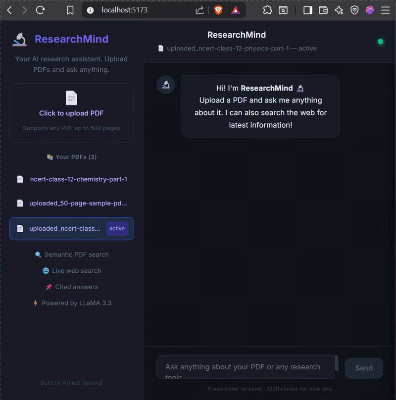
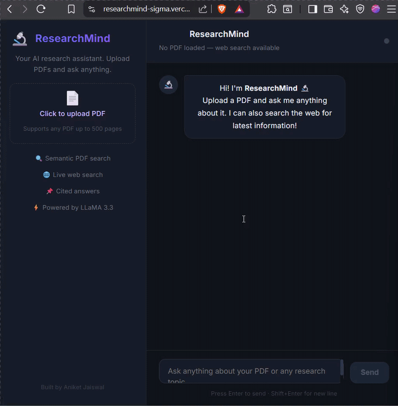

# 🔬 ResearchMind — AI Research Agent

> An intelligent research assistant that chats with your PDFs and searches the web — built with LangChain agents, FAISS vector search, and LLaMA 3.


---

## 🌐 Live Demo

| | Link |
|---|---|
| 🖥️ **Frontend** | https://researchmind-sigma.vercel.app |
| ⚙️ **API Docs** | https://research-agent-production-3bc9.up.railway.app/docs |

> **Note:** Live demo supports web search. For full PDF functionality run locally with Docker. PDF processing requires 1GB+ RAM server.

---

## 📸 Demo

### Local — Full PDF + Web Search


### Live — Web Search with Citations


---

## ✨ Features

- 📄 **PDF Chat** — Upload any PDF and ask questions with page citations
- 🌐 **Web Search** — Real-time web search with clickable sources
- 📌 **Cited Answers** — Every answer includes page numbers and URLs
- 📚 **Multiple PDFs** — Upload and switch between multiple documents
- ⚡ **Fast** — Powered by Groq's LPU inference engine
- 🐳 **Docker Ready** — One command to run everything

---

## 🧠 How the Agent Works

```
User asks: "What is electrochemistry and latest battery tech?"
↓
LLM decides which tools to use
↓
┌───────────────────────────────┐
│                               │
pdf_search_tool              web_search_tool
(FAISS vector search)        (Tavily API)
→ Page 67, NCERT Chemistry   → Forbes, Nature 2025
│                               │
└───────────────┬───────────────┘
↓
LLM combines results + adds citations
↓
"Electrochemistry is... (Source: NCERT, Page 67)
Latest developments... (Forbes)"
```

---

## 🛠️ Tech Stack

```
| Layer | Technology | Why |
|-------|-----------|-----|
| **LLM** | LLaMA 3.1 8B via Groq | Fast, free, powerful |
| **Agent** | LangChain tool-calling | Decides PDF vs web automatically |
| **Embeddings** | FastEmbed (BAAI/bge-small) | Lightweight, no GPU needed |
| **Vector DB** | FAISS | Fast local semantic search |
| **Web Search** | Tavily API | Purpose-built for AI agents |
| **Backend** | FastAPI + Uvicorn | Fast async Python API |
| **Frontend** | React + Vite | Modern, fast UI |
| **Container** | Docker + Docker Compose | One-command deployment |
| **Hosting** | Railway + Vercel | Backend + Frontend split |
```

---

## 🚀 Quick Start

### Option 1 — Docker (Recommended)

```bash
git clone https://github.com/Aniket-Jaiswal2002/research-agent.git
cd research-agent
cp .env.example .env
# Add your API keys to .env
docker-compose up
```

Open **http://localhost:5173** 🎉

### Option 2 — Manual

**Backend:**
```bash
python -m venv venv
venv\Scripts\activate
pip install -r requirements.txt
uvicorn api:app --reload
```

**Frontend:**
```bash
cd frontend
npm install
npm run dev
```

---

## 🔑 Environment Variables

```env
GROQ_API_KEY=your_groq_key_here      # Free at console.groq.com
TAVILY_API_KEY=your_tavily_key_here  # Free at app.tavily.com
```

---

## 📡 API Endpoints

| Method | Endpoint | Description |
|--------|----------|-------------|
| `GET` | `/` | Health check |
| `POST` | `/upload` | Upload and ingest a PDF |
| `POST` | `/ask` | Ask the AI agent |
| `POST` | `/select-pdf` | Switch active PDF |
| `GET` | `/pdfs` | List all PDFs |
| `GET` | `/status` | System status |

---

## 📁 Project Structure

```
research-agent/
├── ingest.py          # PDF → chunks → vectors → FAISS
├── tools.py           # pdf_search_tool + web_search_tool
├── agent.py           # LangChain agent brain
├── api.py             # FastAPI REST endpoints
├── Dockerfile         # Backend container
├── docker-compose.yml # Full stack orchestration
├── requirements.txt   # Python dependencies
├── assets/            # Demo GIFs
└── frontend/
├── src/App.jsx    # React chat UI
└── Dockerfile     # Nginx container
```

---

## 🗺️ Roadmap

- [x] PDF ingestion with FAISS
- [x] LangChain agent with tool calling
- [x] Web search with Tavily
- [x] FastAPI REST backend
- [x] React chat UI with citations
- [x] Multiple PDF support
- [x] Docker deployment
- [x] Live deployment (Railway + Vercel)
- [ ] User authentication
- [ ] Persistent PDF library per user
- [ ] Streaming responses
- [ ] Mobile app

---

## 👨‍💻 Author

**Aniket Jaiswal** — AI Engineer

- 🐙 GitHub: [@Aniket-Jaiswal2002](https://github.com/Aniket-Jaiswal2002)
- 💼 LinkedIn: [Aniket Jaiswal](https://www.linkedin.com/in/aniket-jaiswal-6748a5248/)
- 📧 Open to international AI engineer opportunities

---

## 📄 License

MIT License — feel free to use as a template!